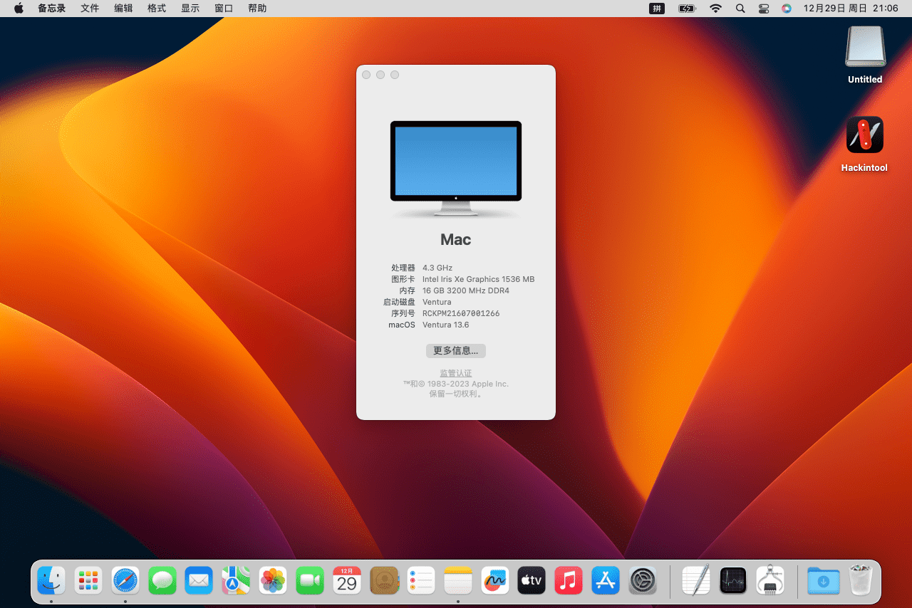

# MateBook14-2021-Hackintosh
MateBook 14 2021款 i7 独显 16GB+512GB 触屏 (KLVD-WFE9)
 
tips:装之前，慎重考虑，用着不流畅
### CPU
* CPU 11th Gen Intel(R) Core(TM) i7-1165G7 @ 2.80GHz
* 代号：Tiger Lake-U
* 指令集：MMX, SSE, SSE2, SSE3, SSSE3, SSE4.1, SSE4.2, Intel 64, NX, VMX, AES, AVX, AVX2, FMA3
* 内核数量：4
* TigerLake-LP GT2 [Iris Xe Graphics]   （https://devicehunt.com/search/type/pci/vendor/any/device/9A49）
* 设备ID：0x9A498086

## 显卡
* GPU NVIDIA GeForce MX450

## 无线网卡
* Wi-Fi Intel(R) Wi-Fi 6 AX201 160MHz

## 硬盘
* KIOXIA-EXCERIA PRO SSD

## 日志参数记录
* MMIO：4261478400，4277141504
* OCABC: MAT support is 1

## Bios 设置
- Boot
  - Secure Boot Control : `Off`
- Using RU.efi
  - CpuSetup `(VarStore : 0x3)`
    - CFG Lock `(Variable : 0x43)` : Disabled `(Value : 0x0)`
  - SaSetup `(VarStore : 0x2)`
    - DVMT Pre-Allocated `(Variable : 0x84)` : 64MB `(Value : 0x2)`

## 如果卡 EB 就将config.plist内的对应配置改成下面的
* DevirtualiseMmio->false
* SetupVirtualMap->true
* EnableWriteUnprotector->false|true
* RebuildAppleMemoryMap->true
* SyncRuntimePermissions->true
* AppleCpuPmCfgLock->true|false
* AppleXcpmCfgLock->true|false
* AppleXcpmExtraMsrs->true
* AvoidRuntimeDefrag->true
* IgnoreInvalidFlexRatio->false
* SecureBootModel->Disabled
* Cpuid1Data->6wYJAAAAAAAAAAAAAAAAAA==
* Cpuid1Mask->/////wAAAAAAAAAAAAAAAA==

## 如果要加载  ICLLP Frambuffer 就将config.plist内的对应配置改成下面的
* 相关来源https://github.com/lshbluesky/Samsung-NT750XDA-KF59U-Hackintosh
* 相关来源https://www.insanelymac.com/forum/topic/358305-80-solved-iris-xe-igpu-on-tiger-lake-successfully-loaded-icllp-frambuffer-and-vram-also-recognizes-1536mb-however-some-issues/page/6/
* Add->
```
<key>PciRoot(0x0)/Pci(0x2,0x0)</key>
        <dict>
          <key>AAPL,GfxYTile</key>
          <data>AQAAAA==</data>
          <key>AAPL,ig-platform-id</key>
          <data>AABxig==</data>
          <key>AAPL,slot-name</key>
          <string>Internal@0,2,0</string>
          <key>AAPL00,override-no-connect</key>
          <data>AP///////wAJ5QYKAAAAAAEfAQSlIhN4AiEQmFxXjCgbTlMAAAABAQEBAQEBAQEBAQEBAQEBuTeA3HA4H0AwIDUAWMIQAAAaAAAAAAAAAAAAAAAAAAAAAAAaAAAA/gBCT0UgMTgKICAgICAgAAAA/gBORTE1NkZITS1OUzAKACY=</data>
          <key>complete-modeset</key>
          <data>AQAAAA==</data>
          <key>device-id</key>
          <data>cYoAAA==</data>
          <key>device_type</key>
          <string>VGA compatible controller</string>
          <key>disable-agdc</key>
          <data>AQAAAA==</data>
          <key>dpcd-max-link-rate</key>
          <data>CgAAAA==</data>
          <key>enable-cdclk-frequency-fix</key>
          <data>AQAAAA==</data>
          <key>enable-dbuf-early-optimizer</key>
          <data>AQAAAA==</data>
          <key>enable-dpcd-max-link-rate-fix</key>
          <data>AQAAAA==</data>
          <key>enable-dvmt-calc-fix</key>
          <data>AQAAAA==</data>
          <key>force-online</key>
          <data>AQAAAA==</data>
          <key>framebuffer-patch-enable</key>
          <data>AQAAAA==</data>
	  <key>framebuffer-unifiedmem</key>
	  <data>AAAAgA==</data>
          <key>model</key>
          <string>Intel Iris Xe Graphics</string>
        </dict>
```
